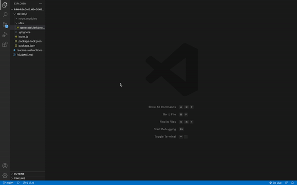

# PRO-README.MD-GENERATOR

  ## Table of Contents 
  - [Description](#description)
  - [Installation](#installation)
  - [Usage](#usage)
  - [Additional Info](#additional-info)

  ## Mock-Up
  

  ## Description:
  The above mock up demonstrates the usage of the application

  ## Installation:
  - Download it through Github
  - Ensure inquirer is installed using `npm i` in the terminal

  ## Usage:
  - Open terminal
  - Type 'node index.js'
  - Respond to prompts
  - After completion, a README will generate